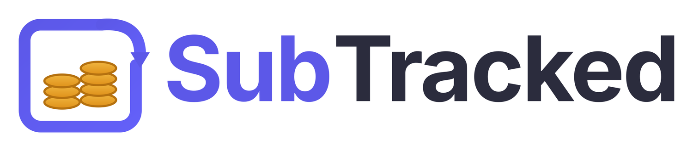
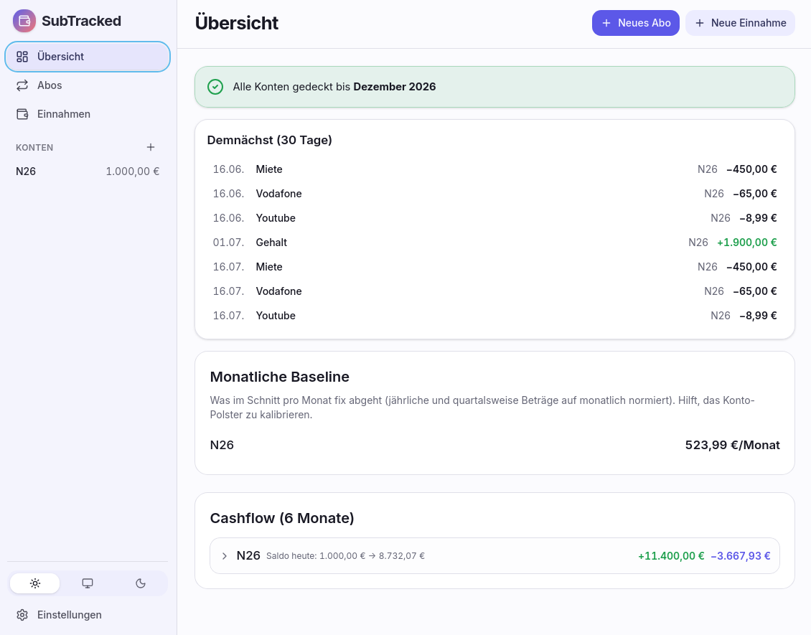
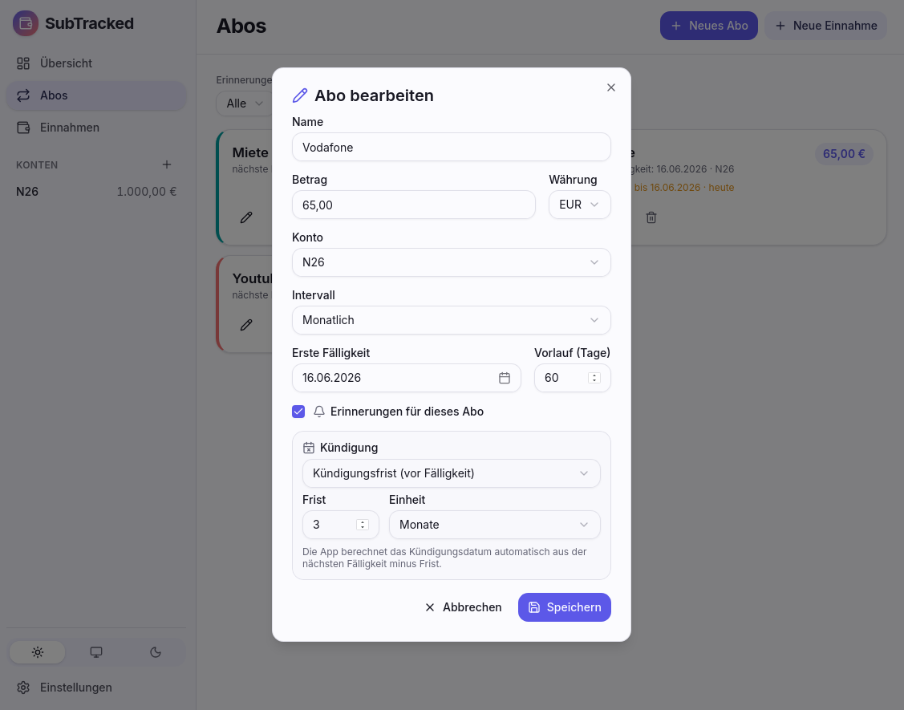
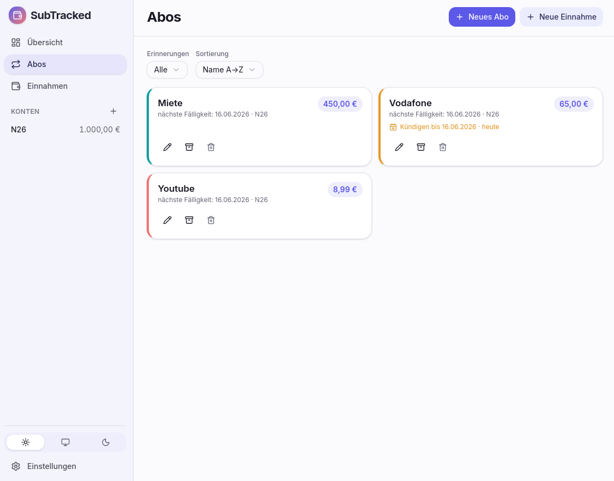
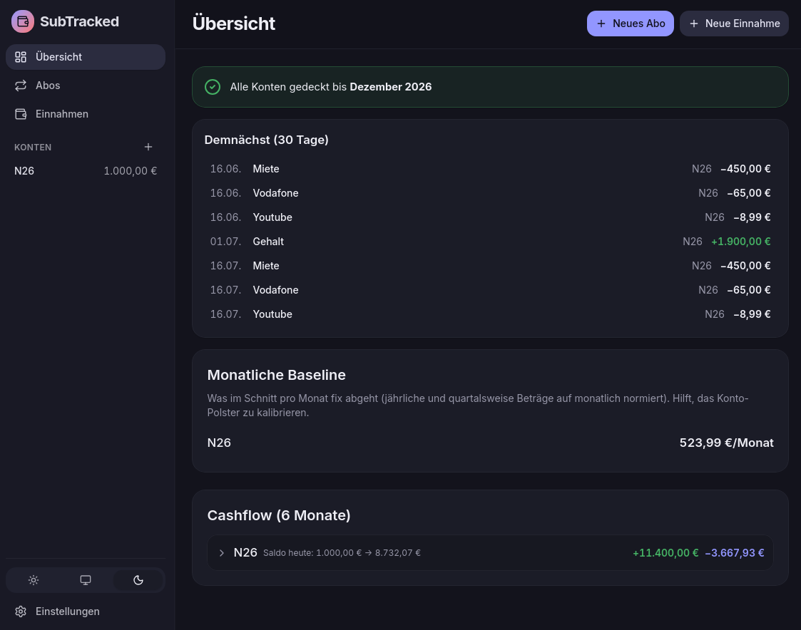
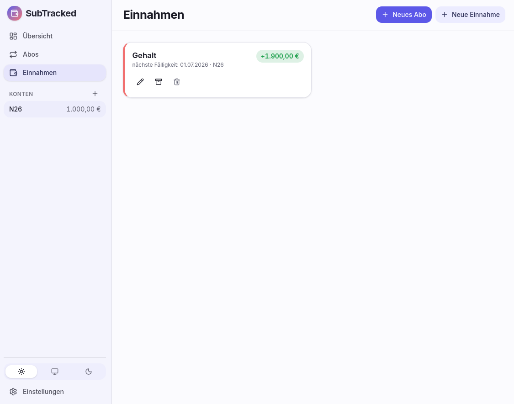

<p align="center">
  
</p>

# SubTracked

**SubTracked zeigt dir nicht nur, was deine Abos kosten — sondern wann dein Konto durch kommende Abbuchungen knapp wird.**

Ein lokaler Liquiditäts-Radar für wiederkehrende Zahlungen: SubTracked pflegt deine Abos, schreibt deine Konten in die Zukunft fort und warnt früh, wenn ein Saldo unter den Mindestpuffer oder ins Minus fällt. Native Desktop-App, leise im Tray, ohne Account und ohne Cloud.

## Warum?

Tabellen reichen für eine Liste von Abos. Sie werden aber schnell mühsam, sobald die eigentliche Frage lautet:

> Ist mein Konto zum Abbuchungszeitpunkt noch gedeckt?

SubTracked ist für genau diesen Blick gebaut: Was geht demnächst ab, von welchem Konto, und wo wird es eng? Die Daten bleiben lokal auf deinem Rechner — keine Synchronisierung mit einem Server, kein SaaS, kein Tracking.

## Screenshots

<p align="center">
  
</p>

<table>
  <tr>
    <td width="50%"><br><sub><b>Abo anlegen</b> — Intervall plus optionale Kündigungsfrist (Tage/Wochen/Monate) oder festes Stichdatum.</sub></td>
    <td width="50%"><br><sub><b>Abo-Liste</b> — Karten mit „Kündigen bis“-Hinweis, dazu Filter und Sortierung.</sub></td>
  </tr>
  <tr>
    <td width="50%"><br><sub><b>Dunkler Modus</b> — umschaltbar zwischen Hell, Dunkel und System.</sub></td>
    <td width="50%"><br><sub><b>Einnahmen</b> — wiederkehrende und einmalige Zuflüsse fließen in den Forecast ein.</sub></td>
  </tr>
</table>

## Funktionen

### Oberfläche

- **Dashboard-Layout** mit fester Seitenleiste (Navigation, Konten-Salden, Theme-Umschalter) und fluid-responsivem Karten-Grid, das sich an die Fensterbreite anpasst.
- **Hell-/Dunkel-Modus** mit Drei-Wege-Umschalter (Hell / Dunkel / System) — folgt auf Wunsch automatisch dem Betriebssystem.
- **Durchgehend deutschsprachige Oberfläche** mit klaren Anlege-Dialogen und sofortiger Feldvalidierung.

### Konten + Deckung

- **Konten mit Saldo und Mindestpuffer**: pro Konto Währung, aktueller Stand und optionaler Sicherheitsbetrag. Der Saldo wird ab heute mit den anstehenden Abbuchungen fortgeschrieben.
- **Deckungswarnung**: orange Markierung sobald der Forecast unter den Mindestpuffer fällt, rot sobald er unter null geht. Pro Buchung sieht man den Saldo danach.
- **Saubere Mehrwährungs-Sicht**: jedes Konto rechnet in seiner eigenen Währung, fremde Abos werden ehrlich als „N Abos in anderer Währung werden hier nicht berücksichtigt" markiert statt heimlich umgerechnet.

### Abos

- **Verwalten** mit Name, Betrag, Konto, Intervall und erster Fälligkeit. Toleranter Betrags-Parser (akzeptiert `12,99`, `12.99`, `1.234,56`).
- **Flexible Intervalle**: wöchentlich, zweiwöchentlich, monatlich, alle 2 Monate, quartalsweise, halbjährlich und jährlich. Die Fälligkeitsberechnung ist anker-additiv — ein Abo am 31. driftet nicht auf den 28., sondern fällt in jedem Monat mit 31 Tagen wieder korrekt auf den 31.
- **Kündigung im Blick**: pro Abo optional eine Kündigungsfrist (Anzahl + Tage/Wochen/Monate) **oder** ein festes Stichdatum. Die App zeigt automatisch, bis wann gekündigt werden muss, und hebt nahende oder verstrichene Fristen hervor.
- **Demnächst (30 Tage)**: kompakte Liste aller Fälligkeiten im nächsten Monat — der tägliche Arbeitsmodus.
- **Filter und Sortierung** für die Abo-Liste (nach Konto, Währung, Erinnerungs-Status; sortierbar nach Name, Fälligkeit, Betrag).
- **Archivieren statt Löschen**: gekündigte oder pausierte Abos verschwinden aus dem Forecast, lassen sich aber jederzeit reaktivieren.
- **Preis-Historie**: Betragsänderungen werden gespeichert und im Bearbeiten-Dialog als Liste plus kleiner Verlaufsgrafik sichtbar.

### Einnahmen + Backup

- **Wiederkehrende Einnahmen** fließen in den Cashflow-Forecast ein, damit nicht nur Abbuchungen, sondern auch Gehalt und andere Zuflüsse berücksichtigt werden.
- **Einmalige Einnahmen** wie Bonus, Erstattung oder Verkaufserlös können genau an einem Datum eingeplant werden.
- **JSON-Backup / Restore** über die Einstellungen: vollständiger lokaler Datenexport inklusive Konten, Abos, Einnahmen, Preis-Historie und Reminder-Metadaten.

### Erinnerungen

- **Native System-Notifications** mit einstellbarer Vorlaufzeit pro Abo, pro Abo stummschaltbar.
- **Sichtbarer Reminder-Status** in den Einstellungen: letzte Prüfung, nächste geplante Prüfung, letzte gesendete Erinnerung — plus Button für eine sofortige Test-Notification.
- **Idempotente Sendung**: ein Reminder wird erst dann als „gesendet" markiert, wenn die Notification wirklich rausging.

### Hintergrund-Betrieb

- **Tray-Icon**, Fenster-X versteckt das Fenster (App läuft weiter).
- **Autostart beim Login** über die Einstellungen aktivierbar.
- **Stündlicher Reminder-Loop** im Rust-Hauptprozess — unabhängig vom Webview-Lifecycle, läuft auch wenn das Fenster versteckt ist.

## Lokal-first

SubTracked ist bewusst als lokale Desktop-App gebaut:

- keine Registrierung
- kein Account
- keine Cloud-Datenbank
- keine Server-Synchronisierung
- SQLite-Datenbank im lokalen App-Verzeichnis
- native Notifications über das Betriebssystem

Das passt zur Domäne: Abo- und Kontodaten sind private Finanzdaten. Die App soll dir helfen, sie im Blick zu behalten, ohne sie irgendwo hochzuladen.

## Status

Funktionale, aktiv genutzte Version (Stand 2026-06-16, aktuelles Release `v0.2.0`). Entwickelt und täglich genutzt auf Linux (KDE/CachyOS). Windows und macOS werden vor jedem Release per Smoke-Test geprüft.

`v0.2.0` brachte einen kompletten UI-Overhaul (Dashboard-Layout, Hell-/Dunkel-Modus, neues Branding) sowie variable Intervalle und Kündigungsfristen. Die Installer werden über GitHub Actions für Linux, Windows und macOS gebaut und als GitHub-Release veröffentlicht.

## Download

Die aktuellen Installer findest du auf der [GitHub-Releases-Seite](https://github.com/TCGTVV/SubTracked/releases/latest). Für normale Nutzung brauchst du **nicht** aus dem Quellcode zu bauen. Die Dateinamen tragen jeweils die aktuelle Versionsnummer (unten am Beispiel `0.2.0`).

| System | Empfohlener Download | Hinweis |
| --- | --- | --- |
| **Windows** | `SubTracked_0.2.0_x64_en-US.msi` | Alternativ `SubTracked_0.2.0_x64-setup.exe`. |
| **macOS Apple Silicon** | `SubTracked_0.2.0_aarch64.dmg` | Für Macs mit M1/M2/M3/M4. |
| **macOS Intel** | `SubTracked_0.2.0_x64.dmg` | Für ältere Intel-Macs. |
| **Linux Debian/Ubuntu** | `SubTracked_0.2.0_amd64.deb` | Für Debian-, Ubuntu- und verwandte Systeme. |
| **Linux Fedora/openSUSE/RHEL** | `SubTracked-0.2.0-1.x86_64.rpm` | Für RPM-basierte Distributionen. |
| **Linux universell** | `SubTracked_0.2.0_amd64.AppImage` | Kann ohne Installation gestartet werden. |

### Hinweis zu unsignierten Builds

Die Builds sind noch nicht code-signiert. macOS Gatekeeper und Windows SmartScreen können beim ersten Start warnen. Das ist bei dieser frühen Version erwartet:

- **macOS:** `.dmg` öffnen, App nach `Applications` ziehen, dann im Finder per Rechtsklick → **Öffnen** starten.
- **Windows:** SmartScreen → **Weitere Informationen** → **Trotzdem ausführen**.

Die App speichert ihre Daten lokal in einer SQLite-Datenbank im App-Verzeichnis deines Betriebssystems. Backups kannst du jederzeit über die Einstellungen exportieren.

## Roadmap

Die nächsten sinnvollen Schritte:

- **In-App-Updater** für spätere Versionen, sobald die Release-Pipeline signiert ist.
- **Kategorien/Tags für Abos** für Auswertungen und Filterung.
- **CSV-Export** der Abos zusätzlich zum bestehenden JSON-Backup.
- **Besseres Onboarding**, damit der erste Start schneller zum Nutzen führt.

Details stehen in [BACKLOG.md](./BACKLOG.md).

## Tech

- **[Tauri 2](https://tauri.app/)** (Rust-Kern, System-WebView)
- **React 19** + **TypeScript** (strict)
- **Tailwind CSS v4** + **shadcn/ui** (auf `radix-ui`) + **lucide-react** für die Oberfläche, mit Hell-/Dunkel-Theming
- **SQLite** über eigenen [`sqlx`](https://github.com/launchbadge/sqlx)-Pool im Rust-Hauptprozess (WAL-Mode, Migrations via `sqlx::migrate!`)
- **Reminder-Loop** in Rust mit `tokio` + `chrono`, sendet native OS-Notifications über [`tauri-plugin-notification`](https://github.com/tauri-apps/plugins-workspace/tree/v2/plugins/notification)
- **Biome** für Lint + Format
- **Vitest** (Frontend) + **`cargo test`** (Rust) für Tests, **Lefthook** als Pre-Commit-Gate, GitHub Actions als CI

## Aus Source bauen

Voraussetzungen:

- Node ≥ 22.13 und [pnpm](https://pnpm.io/)
- Rust (stable)
- [Tauri-Build-Deps](https://tauri.app/start/prerequisites/) für dein OS (auf Linux z.B. `webkit2gtk`, `libayatana-appindicator`, …)

```bash
pnpm install
pnpm tauri dev      # Dev-Modus mit Hot-Reload
pnpm tauri build    # OS-spezifischer Installer in src-tauri/target/release/bundle/
```

## Entwicklung

Lint, Tests und Qualitäts-Gates lokal (Rust-Befehle aus `src-tauri/`):

```bash
pnpm lint                                       # Biome (Lint + Format-Check)
pnpm test:run                                   # Vitest (Frontend-Unit-Tests)
cd src-tauri && cargo test                      # Rust-Tests (Recurrence-Logik)
cd src-tauri && cargo clippy --all-targets -- -D warnings
```

[Lefthook](https://github.com/evilmartians/lefthook) hängt sich beim Commit automatisch ein und fährt diese parallel; Push triggert GitHub Actions als zusätzlichen Lauf.

## Lizenz

MIT — siehe [LICENSE](LICENSE).
